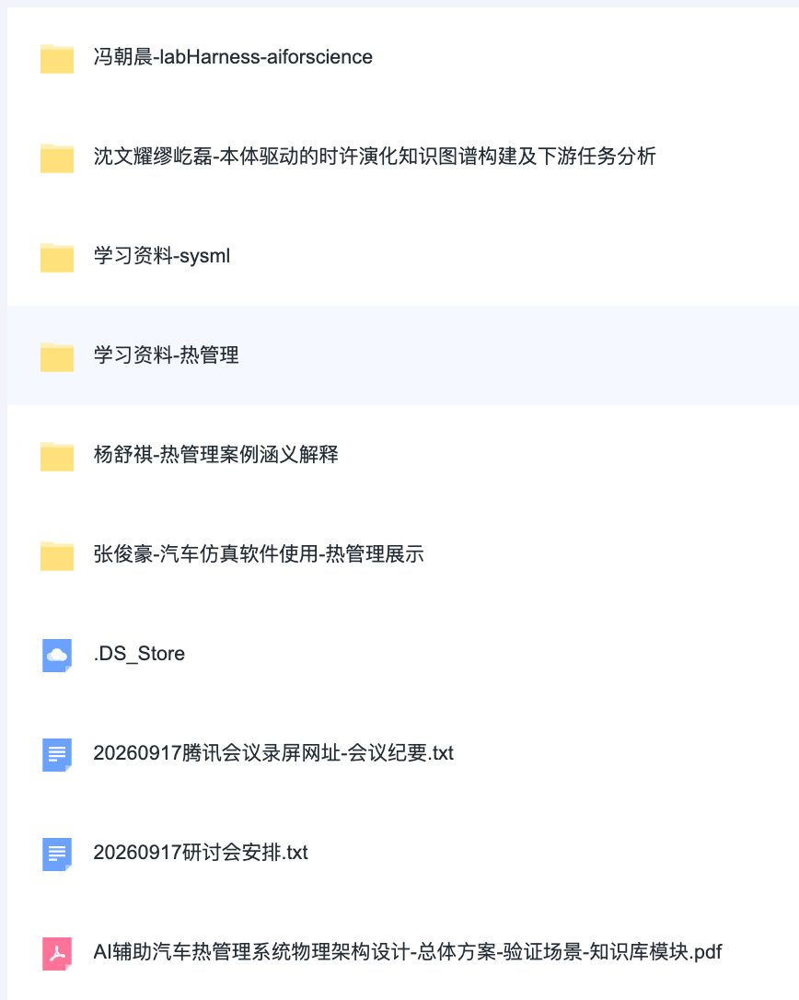
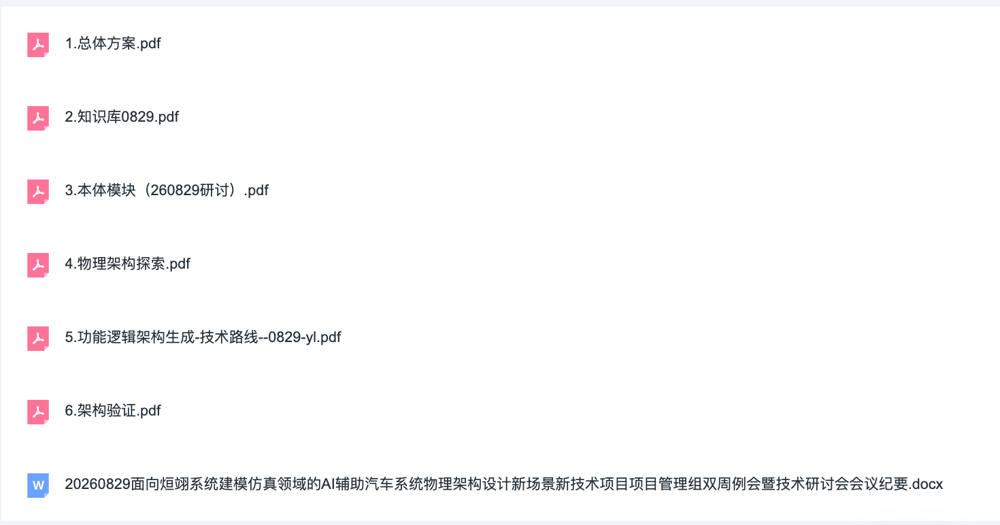
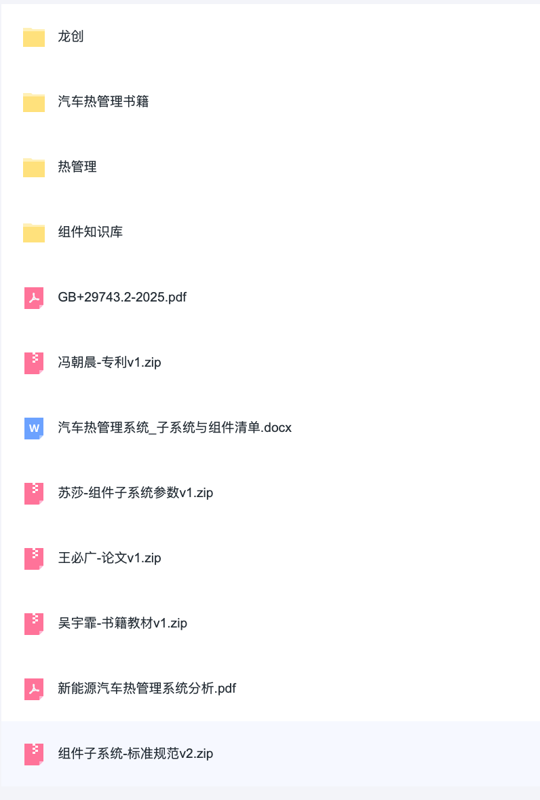
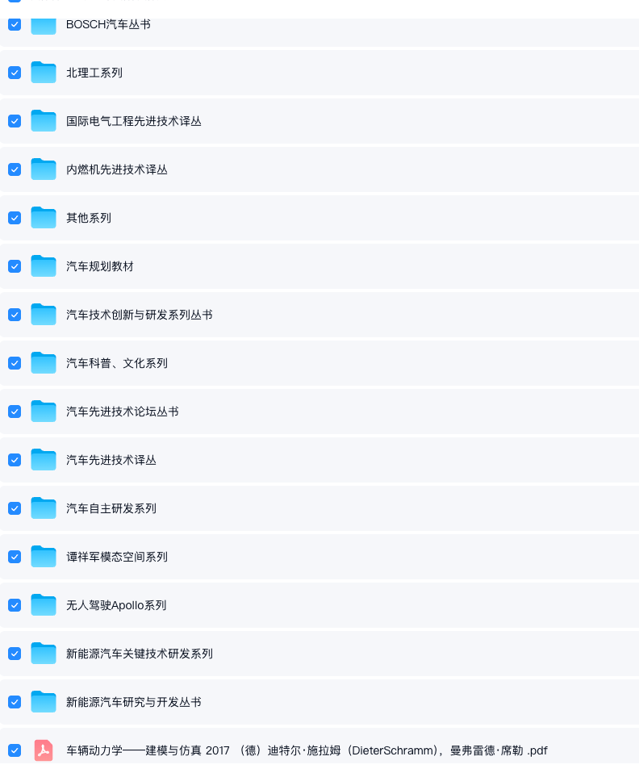

# 汽车热管理知识库构建

## 说明

本页用于归档「汽车热管理 / 知识库构建」相关讨论班记录与资料入口。

- **两大类资料**：
  1. 技术研讨资料（每次汇报）
  2. 数据原料与相关文件（梳理、收集）

---

## 资料总览

| 类别   | 说明                      | 入口                    |
| ---- | ----------------------- | --------------------- |
| 技术研讨 | 汇报 PPT、录屏、讲解材料 + 当次相关资料 | [见下文「一」](#一技术研讨资料)    |
| 数据原料 | 早期梳理/收集的文件包，包含原始材料和整理文件 | [见下文「二」](#二数据原料与相关资料) |

---

## 一、技术研讨资料

### 2026.9.17

#### A. 汇报内容

- 会议录屏：https://meeting.tencent.com/crm/ldXVMWnp4b
- 会议要点：
  - 会议围绕汽车热管理系统的架构设计、仿真验证流程及AI知识库构建进行了深入研讨，明确了多源数据解析、仿真与设计的数据边界，并规划了基于Agent的自动化知识库构建技术路径。

#### B. 当次相关资料

- 资料链接：https://pan.nuaa.edu.cn/share/22d02de986f3c777eb1160decf
- 链接文件一览： 
- 

---
### 2026.8.29

#### A. 汇报内容

- 会议要点：
  - 会议围绕“知识库构建→物理架构探索→物理架构评估”三大核心板块展开，解决从自然语言需求到物理实现路径不清晰、海量方案空间探索与评估难的核心问题，依次对总体技术路线、知识库与本体构建、物理架构探索、功能逻辑分析、物理架构验证、物理架构评估及仿真转换等模块进行了深入研讨。

#### B. 当次相关资料

- 资料链接：https://pan.nuaa.edu.cn/share/879b62a7e5ee288e1bf7ec12f8
- 链接文件一览：
- 

---

## 二、数据原料与相关资料

### 2026.8.27 · 数据原料 v1

- **说明：** 首版原料包，按需取用
- **lishaoyuan**：【数据原料v1】  
  https://pan.nuaa.edu.cn/share/2e1a3cae8638f097dc6f5aed5b
- 链接文件一览：
- 

- **kangdazhou**：S667 汽车书籍资料  
  https://pan.baidu.com/s/1Nd4yNPuIJKrM8GYaRDErgQ?pwd=7fi5  
  提取码：`7fi5`
- 链接文件一览：
- 
